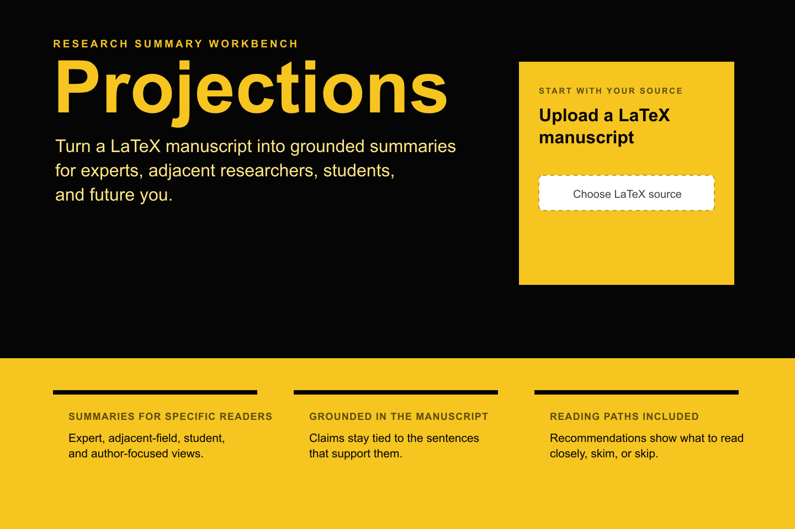

# Projections

Projections turns LaTeX source into audience summaries that stay grounded in the source text.



Upload LaTeX source and Projections produces:

- **Four reader views**: domain expert, adjacent researcher, graduate student, and author notes.
- **A structured outline**: Problem/Motivation, Landscape, Contributions, Technical Core, and Consequences.
- **Traceable grounding**: generated claims reference stable sentence IDs from the paper.
- **Review controls**: inspect labels, edit the structured outline, regenerate audience summaries, and export summaries.
- **Optional PDF support**: compile the source locally and highlight supporting sentences when TeX tooling is available.

## Who It Is For

Projections is built for researchers, reviewers, and technical readers who need to quickly retell the same paper for different levels of expertise without losing the connection to the original text.

It is especially useful when you want to:

- prepare different explanations for a labmate, advisor, or adjacent-field collaborator;
- turn a dense paper into a structured first-pass reading guide;
- verify whether generated summaries are actually supported by source sentences;
- recover the main story of your own paper later.

## Quickstart

Install dependencies:

```bash
npm i
```

Create a local environment file:

```bash
cp .env.example .env.local
```

Set the required API key:

```bash
OPENAI_API_KEY=...
```

The default model is `gpt-5-mini`. Override it with:

```bash
OPENAI_MODEL=...
```

Run the app:

```bash
npm run dev
```

Open [http://localhost:3000](http://localhost:3000).

## How It Works

The pipeline is intentionally simple and inspectable:

1. **Preprocess and segment** the LaTeX source into stable sentence IDs while preserving offsets back to the original text.
2. **Sentence labeling** classifies source windows with rhetorical labels: Problem, Landscape, Contribution, Technical Core, and Consequences.
3. **Outline building** creates the five-part canonical outline from the labeled sentences.
4. **Summary generation** creates the four audience summaries from the canonical outline.
5. **Grounding validation** filters generated sentence references so audience summaries only point to IDs present in the canonical evidence.

The analysis page also exposes a review mode so you can inspect the labeled source, structured outline, citations, and generated audience summaries before sharing exports.

## PDF And Highlighting

PDF compilation is optional. The core summary pipeline does not require TeX binaries.

In local development, TeX compilation is enabled by default and expects `tectonic` in your `PATH`. In production, compilation is disabled by default because typical serverless runtimes do not include native TeX tooling.

To force-enable TeX compilation in a compatible production runtime:

```bash
NEXT_PUBLIC_ENABLE_TEX=1
```

Recommended `tectonic` install options:

```bash
brew install tectonic
```

```bash
conda install -c conda-forge tectonic
```

The compile endpoints use:

```bash
tectonic -X compile --synctex
```

For current highlighting behavior and limitations, see [docs/highlighting.md](docs/highlighting.md).

## Development

Run checks before pushing changes:

```bash
npm run lint
npm test
npm run build
```

Useful files:

- [src/lib/pipeline](src/lib/pipeline) contains segmentation, labeling, canonical-section generation, and audience generation.
- [src/app/api](src/app/api) contains the analysis and LaTeX API routes.
- [src/components](src/components) contains the review, upload, PDF, and audience-view UI.
- [src/lib/latex](src/lib/latex) contains TeX compilation, PDF storage, SyncTeX, and highlighting helpers.

## Notes

- Input is currently `.tex` only.
- Generated summaries are grounded by sentence IDs, but still need human review before publication or citation.
- PDF highlighting is best effort and intentionally avoids some display-math cases to keep LaTeX compilation stable.
